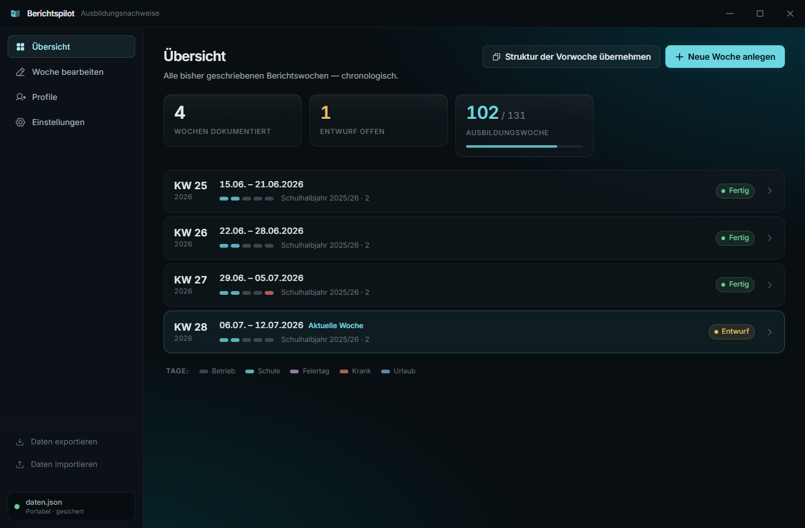
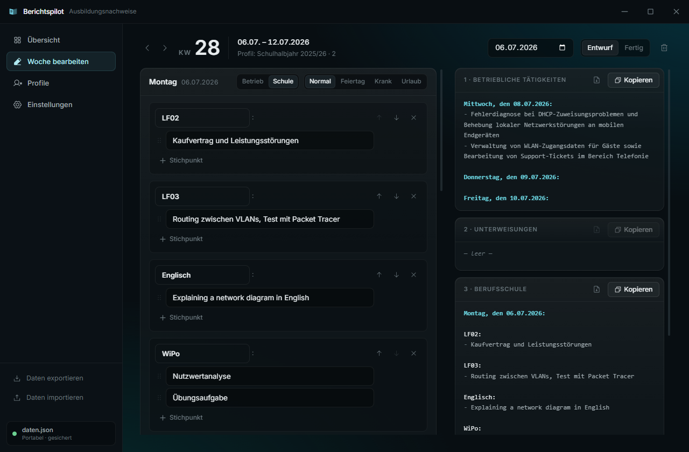
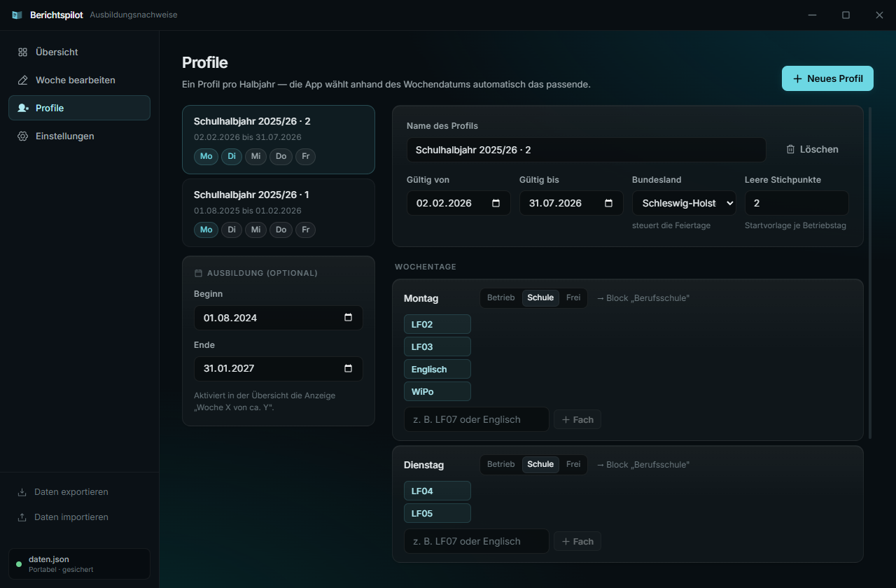

<div align="center">

# 📓 Berichtspilot

**Ausbildungsnachweis-Generator für das digitale IHK-Berichtsheft**

Erzeugt pro Berichtswoche die drei fertig formatierten Textblöcke, die 1:1 ins
IHK-Heft kopiert werden — Wochentage, Datum, Überschriften und Feiertage kommen
automatisch. Man tippt nur noch die eigentlichen Tätigkeiten ein.

<!-- Desktop app that turns weekly notes into the exact three text blocks
     the German IHK apprenticeship report ("Berichtsheft") expects. UI is in German. -->

[](LICENSE)




</div>

---

## Was ist das?

Als Azubi muss man wöchentlich ein Berichtsheft führen. Im digitalen IHK-Portal
gibt es dafür drei Eingabefelder. Diese App nimmt die eigentliche Fleißarbeit ab:

- **Datum & Wochentage** werden aus der Kalenderwoche berechnet.
- **Feiertage** werden komplett offline erkannt (Gaußsche Osterformel, je Bundesland).
- **Schul- und Betriebstage** kommen aus einem konfigurierbaren **Profil pro Halbjahr**.
- Die drei **Ausgabeblöcke** entstehen live im exakt geforderten Format — inklusive
  aller Leerzeilen-Regeln — und liegen per Klick in der Zwischenablage.

Alles läuft lokal. Keine Cloud, kein Konto, keine Internetverbindung nötig.

## Features

- 🗂️ **Übersicht** aller Berichtswochen mit Kalenderwoche, Zeitraum, Status
  (Entwurf/Fertig) und Fortschrittsanzeige.
- ✍️ **Wochen-Editor** mit Live-Vorschau der drei Ausgabeblöcke und Kopier-Buttons.
- 🧑‍🏫 **Profile pro Halbjahr** — die App zieht anhand des Wochendatums automatisch
  das passende Profil (z. B. „Mo = Schule" wird zu „Mo + Di = Schule").
- 🎉 **Feiertage offline** für alle 16 Bundesländer, inkl. beweglicher Feiertage.
- 🏷️ **Tagesstatus** Normal / Feiertag (auto) / Krank / Urlaub.
- 💾 **Robuste Speicherung:** alle Daten in **einer `daten.json`** — bei der
  installierten App im nutzereigenen Datenordner, in der portablen Version neben der
  App. **Atomares Schreiben** mit rollierenden **Backups** (`.bak1`–`.bak3`) schützt
  das Berichtsheft vor Datenverlust bei Absturz/Stromausfall. Plus Export/Import.
- 🎨 Rahmenloses Fenster mit eigener Titlebar, Dark Mode, weiche GSAP-Übergänge.

## Screenshots

| Wochen-Editor mit Live-Format | Profile / Halbjahre |
| :---: | :---: |
|  |  |

Links wird getippt, rechts entsteht sofort das fertige Zielformat mit „Kopieren"-Button.

## Installation (fertige App)

Fertige Builds gibt es unter **[Releases](https://github.com/Rexi255/berichtspilot/releases)**:

- **Windows (empfohlen):** `Berichtspilot-Setup-<version>.exe` — der Installer. Legt
  Startmenü- und Desktop-Verknüpfung an, der Installationsordner ist frei wählbar
  und standardmäßig **ohne Adminrechte** (Installation pro Benutzer).
- **Windows portabel:** `Berichtspilot-<version>-portable.exe` — ohne Installation,
  einfach doppelklicken (z. B. direkt vom USB-Stick).
- **Linux:** `Berichtspilot-<version>.AppImage` — ausführbar machen (`chmod +x`) und starten.

### Wo liegen meine Daten?

- **Installiert:** im nutzereigenen Datenordner (`%APPDATA%\Berichtspilot` unter
  Windows, `~/.config/Berichtspilot` unter Linux). Der ist **immer beschreibbar** —
  auch wenn die App unter `C:\Program Files` bzw. `/usr/bin` liegt. Beim Deinstallieren
  bleiben die Daten erhalten.
- **Portabel:** in `daten.json` **neben der Executable** — Datei/Ordner kopieren, und
  die Daten wandern mit. Liegt die portable Version ausnahmsweise an einem
  schreibgeschützten Ort, weicht sie automatisch auf den nutzereigenen Datenordner aus,
  statt abzustürzen.

Den genauen Pfad zeigt die App unten links in der Seitenleiste (Tooltip). Neben der
`daten.json` liegen automatisch bis zu drei rollierende Sicherungen (`.bak1`–`.bak3`);
ist die Hauptdatei einmal beschädigt, stellt die App beim Start automatisch den
jüngsten intakten Stand wieder her. Zum manuellen Sichern/Umziehen gibt es zusätzlich
**Daten exportieren/importieren**.

## Entwicklung

Voraussetzung: **Node.js ≥ 20.19**.

```bash
npm install
npm run dev        # Vite-Devserver + Electron mit Hot-Reload
npm start          # Renderer bauen + Electron auf dem Build starten
```

## Build

```bash
npm run build:win    # Windows: Installer (.exe) + portable .exe  -> release/
npm run build:linux  # Linux AppImage                             -> release/ (auf Linux ausführen)
npm run build        # beide Plattformen
```

Wer die [CI](.github/workflows/release.yml) nutzt: Ein Versions-Tag pushen
(`git tag v1.0.1 && git push --tags`) baut beide Artefakte automatisch und hängt
sie an ein GitHub-Release.

## Ausgabeformat

Das Format ist Pflicht und entspricht exakt den echten IHK-Berichten.

**Block 1 — Betriebliche Tätigkeiten** (eine Leerzeile zwischen den Tagen):

```
Mittwoch, den 08.07.2026:
- Fehlerdiagnose bei DHCP-Zuweisungsproblemen und Behebung lokaler Netzwerkstörungen
- Verwaltung von WLAN-Zugangsdaten für Gäste sowie Bearbeitung von Support-Tickets
```

Feiertag/Krank/Urlaub ersetzen die Stichpunkte durch eine Statuszeile
(`- Feiertag: Tag der Arbeit`, `- Krankheitstag`, `- Urlaub`).

**Block 2 — Unterweisungen:** freier Text, meist leer.

**Block 3 — Berufsschule** (Header, Leerzeile, Fächer mit Bullets; eine Leerzeile
zwischen Fächern, **zwei** zwischen den Tagen):

```
Montag, den 06.07.2026:

LF02:
- Kaufvertrag und Leistungsstörungen

Englisch:
- Explaining a network diagram in English
```

## Projektstruktur

```
electron/
  main.js        # Fenster, Ablageort + sicheres Speichern, Datei-I/O per IPC
  preload.js     # schmale contextBridge-API für den Renderer
src/
  lib/dates.js   # Wochentag/Datum, ISO-Kalenderwoche
  lib/holidays.js# Feiertage je Bundesland (Osterformel, offline)
  lib/format.js  # exaktes Ausgabeformat der drei Blöcke
  lib/model.js   # Profile, Wochen, Seed-Daten
  views/         # Übersicht · WochenEditor · Profile · Einstellungen
  ui/            # Titlebar, Sidebar, Design-System-Bausteine
```

## Technik & Sicherheit

- **Electron + Vite + React + Tailwind CSS**, Animationen mit GSAP & Lenis.
- **Electron-Härtung:** `contextIsolation: true`, `nodeIntegration: false`,
  `sandbox: true`. Der Renderer bekommt über die Preload-Bridge nur eine schmale API;
  Datei-I/O passiert ausschließlich im Main-Prozess (IPC). Strikte CSP im Renderer.
- **Offline by design:** Feiertage werden lokal berechnet, keine externen Requests.

## Beitragen

Pull Requests und Issues sind willkommen — siehe **[CONTRIBUTING.md](CONTRIBUTING.md)**.

## Haftungsausschluss

Inoffizielles, privates Hilfswerkzeug. **Nicht** mit einer IHK oder dem IHK-Portal
verbunden oder von diesen unterstützt. Die erzeugten Texte vor dem Absenden immer
selbst prüfen — für Richtigkeit und Vollständigkeit der Ausbildungsnachweise ist
jede*r selbst verantwortlich. Nutzung auf eigene Verantwortung, ohne Gewähr.

## Lizenz

[MIT](LICENSE)
